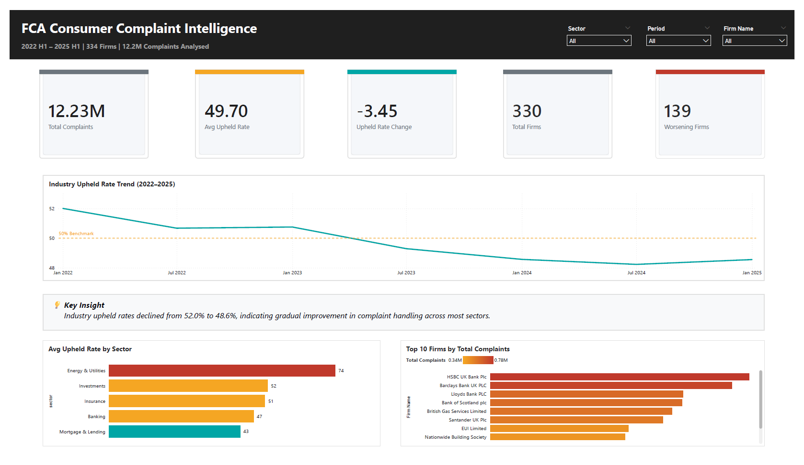
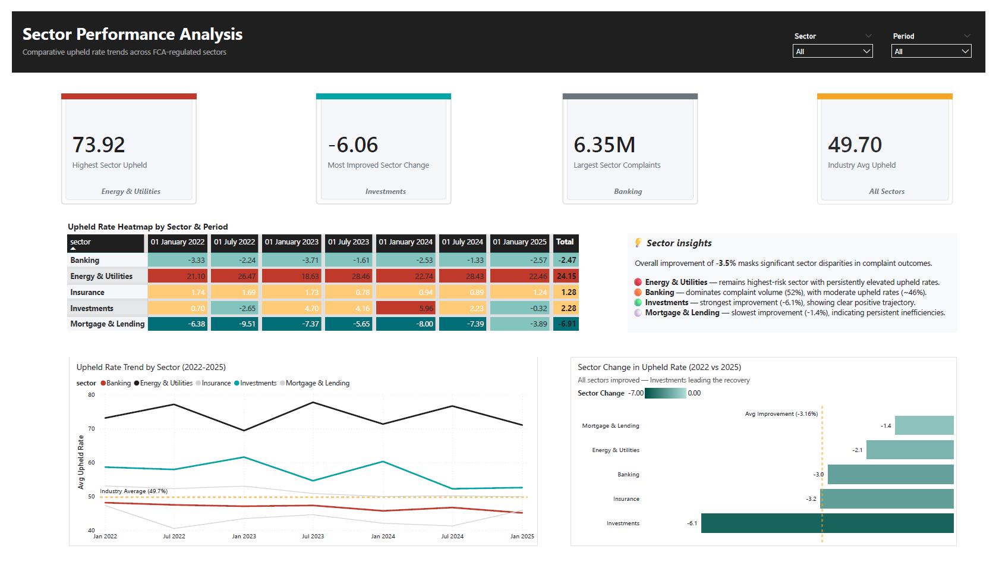
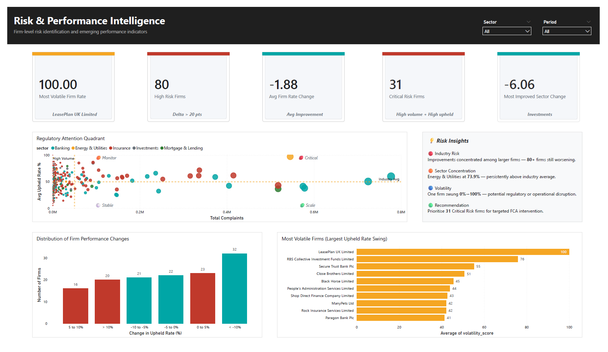
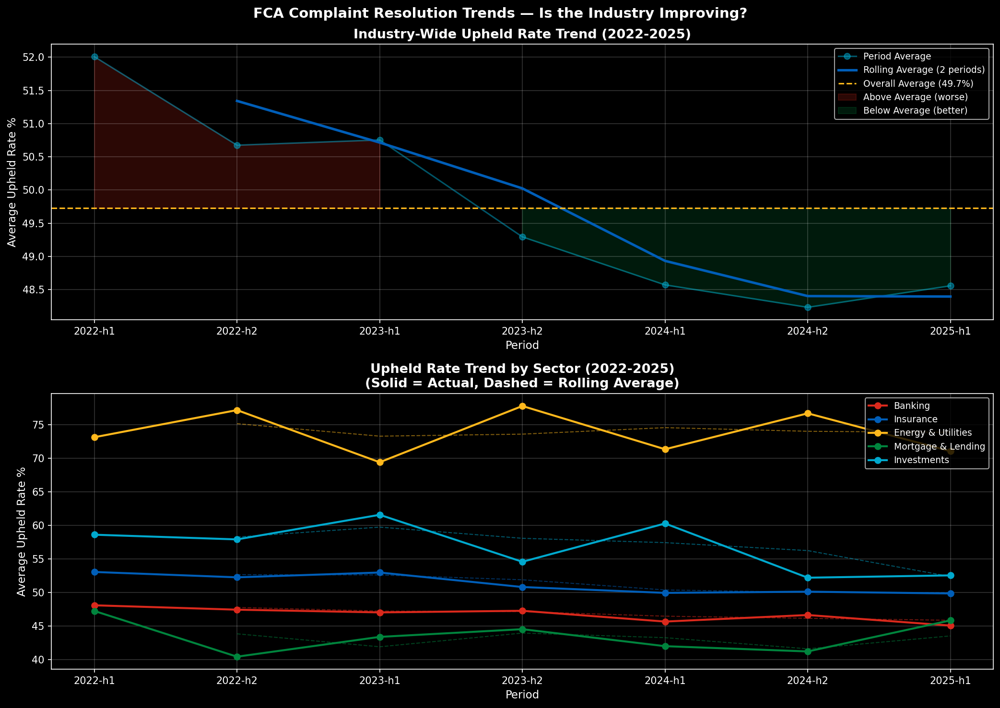
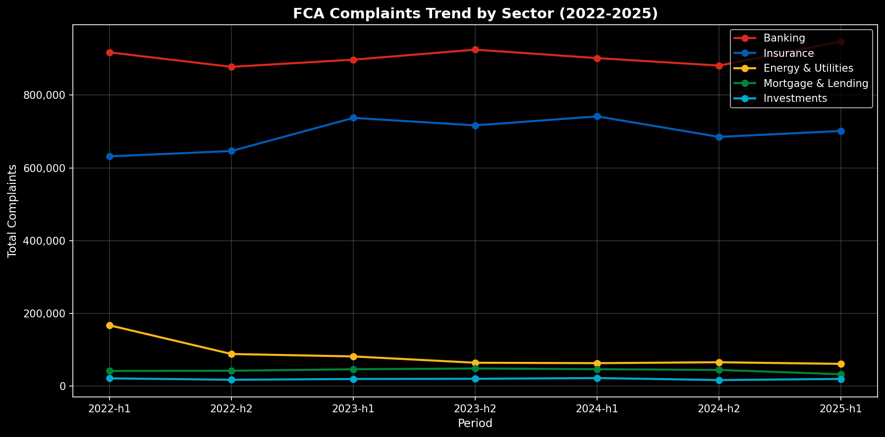
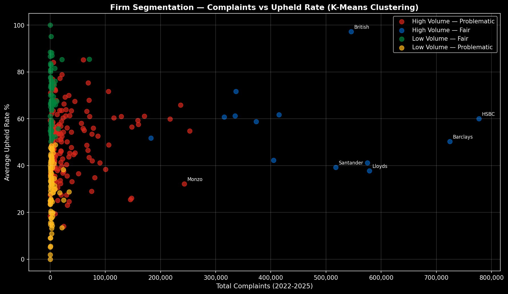
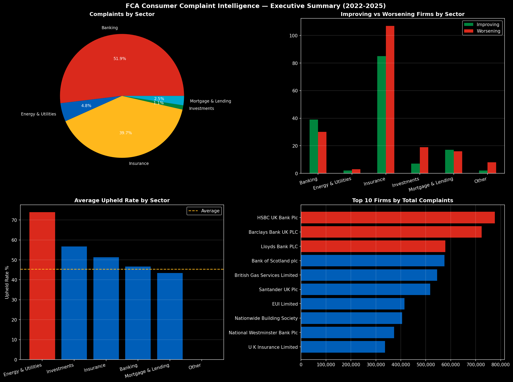

📊 FCA Consumer Complaint Intelligence (2022–2025)

Python | SQL | Power BI | Statistical Analysis | Clustering | Classification
12.2M FCA complaints | 334 firms | 5 financial sectors

An end-to-end data analytics project exploring UK Financial Conduct Authority (FCA) consumer complaint data to identify patterns in firm performance, sector-level differences, and complaint resolution outcomes across 2022–2025.

This project combines data engineering, exploratory analysis, clustering, and dashboard development to analyse variation in complaint behaviour across the UK financial services industry.

🎯 Business Problem
Which UK financial firms and sectors show consistently weak complaint resolution outcomes, and what patterns exist in how complaints are upheld across the industry?

The FCA requires all regulated financial firms in the UK to report complaint data biannually. This project analyses that public dataset to:
-Understand variation in complaint volumes across firms and sectors
-Compare upheld rates across time
-Identify persistent underperformance and volatility patterns

🔍 Key Findings
📌 Scale & Industry Overview
12.2 million complaints analysed across 334 FCA-regulated firms (2022–2025)
49.7% average upheld rate across the industry
Overall industry improvement of 3.5% over the analysis period

📌 Sector Insights
Energy & Utilities shows the highest upheld rate (73.9%), consistently above industry average
Banking accounts for 52% of total complaints despite representing only 22% of firms
Investment sector shows the strongest improvement (-6.1% change in upheld rate)

📌 Firm-Level Patterns
31 firms classified as Critical Risk (high complaints + high upheld rates)
80+ firms show deterioration of more than 20 percentage points since 2022
One firm exhibited extreme volatility (0% → 100% upheld rate swing)

🏗️ Project Architecture
Raw FCA Excel Files (7 reporting periods)
↓
Python Data Pipeline (cleaning, feature engineering, sector classification)
↓
Clean Datasets:

opened_clean.csv
upheld_clean.csv
firm_changes.csv
bucket_counts.csv
↓
Exploratory Analysis (Jupyter Notebook)
↓
Power BI Dashboard (3-page interactive report)

Clustering & Classification Analysis (scikit-learn)

📐 Dashboard Structure

📊 Page 1 — Executive Overview



KPI cards: Total Complaints, Avg Upheld Rate, Change Over Time, Total Firms, Worsening Firms
Industry upheld rate trend (2022–2025) with 50% benchmark
Sector performance comparison
Top firms by complaint volume

📊 Page 2 — Sector Performance Analysis



KPI cards: Highest risk sector, most improved sector, largest complaint sector
Sector deviation heatmap across time
Trend comparison vs industry benchmark
Sector improvement comparison
Insight commentary on structural risk

📊 Page 3 — Risk & Firm Intelligence



KPI cards: High-risk firms, volatility, improvement metrics
Distribution of firm performance changes
Risk quadrant (complaints vs upheld rate segmentation)
Most volatile firms
Interpretation of risk concentration patterns

🛠️ Tools & Techniques
-Python (pandas) — Data cleaning, transformation, feature engineering
-SQL — Data querying and structuring
-scikit-learn — K-Means clustering, Gradient Boosting classification
-Power BI — Interactive dashboards and KPI reporting
-matplotlib / seaborn — Exploratory visualisation
-DAX — Custom measures (risk scoring, deviation, volatility)

🤖 Machine Learning (Exploratory)
📌 K-Means Clustering (K=4)

Used to segment firms into behavioural risk profiles based on complaint volume and upheld rate:
-High Volume – Fair Performance
-High Volume – Problematic Performance
-Low Volume – Fair Performance
-Low Volume – Problematic Performance

This segmentation highlights structural differences in firm behaviour rather than predictive modelling.

📌 Classification Model (Gradient Boosting)

A Gradient Boosting classifier was applied as a demonstration of a supervised learning pipeline.

⚠️ Methodological Note
The model achieved 100% accuracy due to label leakage — the target variable was derived from clustering outputs using the same feature space.

This model is included for pipeline demonstration purposes only, not as a production forecasting system.

A more robust approach would require:

External ground truth labels (e.g. FCA enforcement actions)
Temporal validation (e.g. training on 2022–2023, testing on 2024–2025)

📊 Key Visual Insights

📈 Industry & Sector Trends




The industry shows a gradual improvement in upheld rates over time, decreasing by approximately 3.5% across the analysis period.
However, this improvement is not evenly distributed across sectors.
Energy & Utilities consistently remains above the industry average, indicating structural complaint-handling challenges, while Banking shows high complaint volume but steady improvement over time.


🧠 Risk Segmentation



K-Means clustering (K=4) reveals clear segmentation of firms based on complaint volume and upheld rate behaviour.
The largest concentration of firms falls into the “High Volume – Fair Performance” group, dominated by major retail banks.
A smaller but important cluster of “High Volume – Problematic” firms highlights institutions with both high complaint exposure and weaker resolution outcomes, representing potential regulatory focus areas.

📊 Executive Summary View



The executive summary visual consolidates firm-level and sector-level signals into a single overview of industry health.
It highlights a small subset of firms contributing disproportionately to total complaints, alongside a long tail of lower-volume firms.
This view reinforces the concentration of risk within specific sectors rather than being uniformly distributed across the industry.

🧩 Data Pipeline Summary
1. Ingestion of FCA biannual complaint datasets
2. Standardisation of firm-level reporting formats
3. Feature engineering (rate changes, volatility, sector mapping)
4. Data cleaning and handling inconsistencies across reporting cycles
5. Aggregation at firm and sector level
6. Export to analytical datasets for modelling and dashboarding

📁 Repository Structure

```text
fca-complaints/
│
├── data/
│   ├── opened_clean.csv
│   ├── upheld_clean.csv
│   ├── firm_changes.csv
│   └── bucket_counts.csv
│
├── notebooks/
│   └── analysis.ipynb
│
├── figures/
│   ├── exploratory/
│   │   ├── sector_totals.png
│   │   ├── upheld_trend.png
│   │   ├── sector_trend.png
│   │   └── top_firms_by_sector.png
│   │
│   ├── modelling/
│   │   ├── elbow_curve.png
│   │   ├── clustering.png
│   │   └── classification.png
│   │
│   └── insights/
│       ├── firm_trajectory.png
│       └── executive_summary.png
│
├── screenshots/
│   ├── page1_executive_overview.png
│   ├── page2_sector_analysis.png
│   └── page3_risk_intelligence.png
│
├── pipeline.py
├── FCA_Complaints_Dashboard.pbix
└── README.md
```
⚠️ Limitations
-Analysis based on aggregated biannual firm-level data (no individual complaint-level granularity)
-Sector classification is rule-based and may introduce minor misclassification
-Some firms report on rolling or non-standard cycles, creating minor timing inconsistencies
-Machine learning models are exploratory and not intended for production use
-Results do not account for regulatory or macroeconomic changes over time

📂 Data Source

All data is publicly available from the UK Financial Conduct Authority (FCA):

https://www.fca.org.uk/data/financial-conduct-authority-complaints-data

Covers reporting periods from 2022 H1 to 2025 H1.

📌 Skills Demonstrated
-Large-scale data cleaning and transformation
-Regulatory data analysis
-Feature engineering and time-series analysis
-Unsupervised learning (clustering)
-Supervised learning pipeline design
-KPI and dashboard development
-Data storytelling for non-technical stakeholders

👤 Author
Zaid Rupani
Data Analyst | Python • SQL • ML • Power BI | MSc Data Science and Analytics @ University of Leeds

📧 zaidrupani.work@gmail.com
🔗 LinkedIn: https://www.linkedin.com/in/zaid-rupani-b027b420b/
🔗 Portfolio: https://www.datascienceportfol.io/zaidrupani
